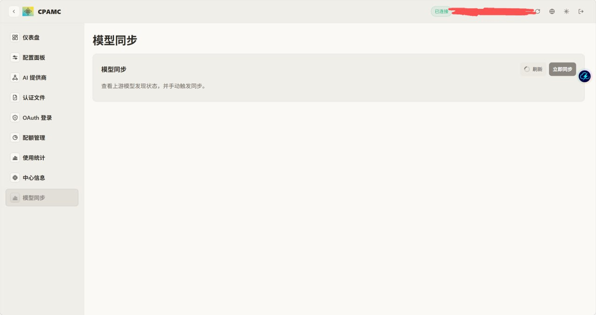

# CLIProxyAPI（JBpeople fork）



这是一个基于 CLIProxyAPI 的实用型分支，重点解决 **OpenAI-compatible 上游提供商** 的模型维护问题：

> 不想手工维护一长串 `models:`，而是希望从上游 `/v1/models` 自动发现模型，并能直接参与调用链路。

## 这个 fork 做了什么

这个 fork 主要增加了针对 `openai-compatibility` 提供商的完整模型发现流程：

- **自动发现模型**：从上游 `/v1/models` 拉取模型列表
- **多 Key 聚合**：遍历所有 `api-key-entries`，合并并去重
- **模型同步管理接口**
  - `GET /v0/management/model-sync/status`
  - `POST /v0/management/model-sync/run`
- **动态模型接入 auth / 路由**
  - 即使 `openai-compatibility[].models` 为空
  - 只要同步发现成功，模型也可以参与 auth 选择与调用
- **OpenAI-compatible 提供商配置页增强**
  - 增加“自动发现模型”开关
- **管理面板增强**
  - 新增“模型同步”页面
  - 支持手动触发同步

## 为什么要做这个 fork

很多 OpenAI-compatible 上游的模型列表变化很快。
如果每次都手动维护：

```yaml
models:
  - name: ...
  - name: ...
```

会非常烦，而且容易漏。

这个 fork 想实现的就是更顺手的流程：

1. 添加一个 OpenAI-compatible 提供商
2. 打开“自动发现模型”
3. 从 `/v1/models` 自动同步
4. 同步出来的模型可以直接参与调用

## 当前行为

- 启动时立即同步一次
- 默认每 **30 分钟** 自动同步一次
- 可通过管理页面 / API 手动同步
- 如果手工配置了 `models`，仍然优先使用手工配置
- 如果 `models: []` 为空，则回退使用自动发现的模型来完成 auth 注册

## OpenAI-compatible 配置示例

```yaml
openai-compatibility:
  - name: local-relay
    base-url: http://127.0.0.1:8317/v1
    auto-discover-models: true
    api-key-entries:
      - api-key: your-key-1
      - api-key: your-key-2
    models: []
```

## 这个 fork 新增的管理接口

```text
GET  /v0/management/model-sync/status
POST /v0/management/model-sync/run
```

## 配套前端仓库

这个 fork 对应的前端面板在这里：

- https://github.com/JBpeople/Cli-Proxy-API-Management-Center

前端增强包括：

- 中文“模型同步”页面
- OpenAI-compatible 编辑页里的“自动发现模型”开关
- 手动同步按钮

## 编译

### Linux
```bash
go build -o build/cliproxyapi ./cmd/server
```

### Windows
```bash
GOOS=windows GOARCH=amd64 go build -o build/cliproxyapi.exe ./cmd/server
```

## 当前定位

这个 fork 面向的是“自己部署自己用”的实用场景。
保留 upstream CLIProxyAPI 作为基础，同时重点增强 OpenAI-compatible 提供商的可维护性与可用性。

## 许可证

MIT
